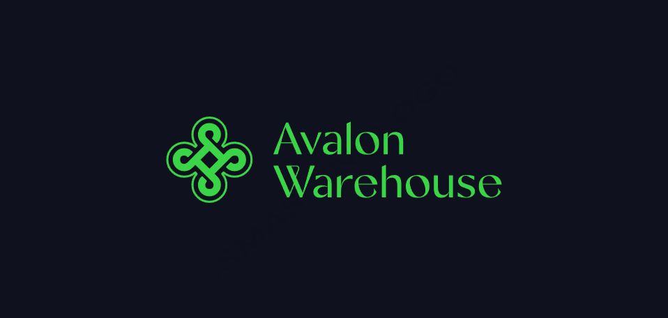
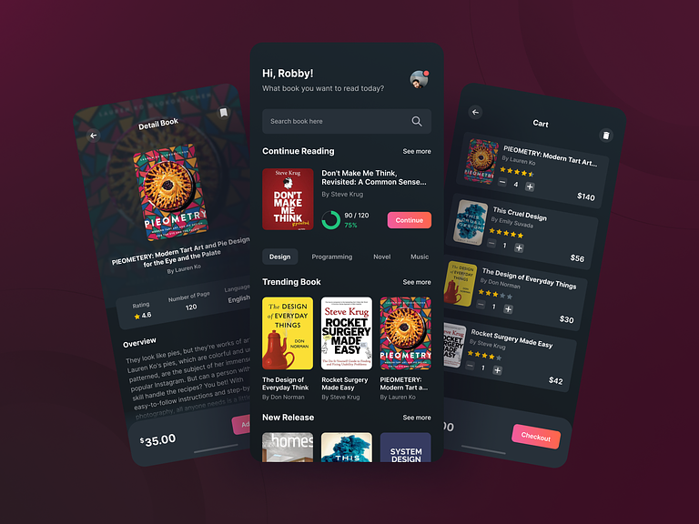

<h1 align="center"> Project: Avalon's Warehouse </h1>

<p align="center">
Avalon Warehouse é um projeto web voltado ao e-commerce que busca oferecer uma experiência de compra literária única e inspiradora. Construído com as mais recentes tecnologias, incluindo React, TypeScript e Styled-components, o site combina a magia da literatura com a conveniência do comércio eletrônico.
</p>

<p align="center">
  <a href="#technologies">Tecnologias</a>&nbsp;&nbsp;&nbsp;|&nbsp;&nbsp;&nbsp;
  <a href="#project">Projeto</a>&nbsp;&nbsp;&nbsp;|&nbsp;&nbsp;&nbsp;
  <a href="#layout">Layout</a>&nbsp;&nbsp;&nbsp;|&nbsp;&nbsp;&nbsp;
  <a href="#license">Licença</a>
</p>

<p align="center">
  
</p>

<br>

<p align="center">
  
</p>

## 🚀 Tecnologias

<p id="technologies">Esse projeto foi desenvolvido com as seguintes tecnologias:</p>

- HTML5, CSS3, JS ES6+
- [Node e Yarn](https://nodejs.org/)
- [React.JS](https://reactjs.org/)
- [Create react-app](https://create-react-app.dev/)
- [Styled components](https://styled-components.com/docs)
- [React-hot-toast](https://react-hot-toast.com/)
- [Typescript](https://www.typescriptlang.org/docs/)
- [ESLint](https://eslint.org/docs/latest/)
- [Prettier](https://prettier.io/docs/en/)
- [Husky](https://typicode.github.io/husky/)
- [Lint-staged](https://www.npmjs.com/package/lint-staged?activeTab=readme)

## 💻 Projeto

<p id="project">
<b>Visão Geral</b>:

Bem-vindo ao Avalon Warehouse, o destino definitivo para amantes da leitura em busca de uma experiência de compra de livros excepcional. Nosso projeto é impulsionado por tecnologia de ponta, combinando React, styled-components, react-hot-toast e TypeScript para criar um ambiente de comércio eletrônico excepcionalmente rápido, interativo e intuitivo.

<b>Principais Recursos e Tecnologias</b>:

<b>React</b>: Utilizamos a poderosa biblioteca React para criar uma interface de usuário dinâmica e responsiva. Isso significa que nosso site se adapta perfeitamente a dispositivos de todos os tamanhos, proporcionando uma experiência de compra fluida.

<b>styled-components</b>: Com styled-components, nossa estilização é elegante, modular e altamente eficiente. Cada elemento do nosso site é cuidadosamente projetado e estilizado para criar uma aparência visualmente atraente e coesa.

<b>react-hot-toast</b>: Implementamos o react-hot-toast para fornecer feedback em tempo real aos nossos usuários. Seja para confirmações de compra, notificações de disponibilidade de produtos ou feedback sobre ações realizadas, o react-hot-toast mantém nossos clientes informados e engajados.

<b>TypeScript</b>: Usamos TypeScript para criar um código robusto, com menos erros e maior manutenibilidade. Isso garante que nosso site seja seguro e eficiente em termos de desempenho.

<b>Nosso Objetivo</b>:

No Avalon Warehouse, nosso principal objetivo é fornecer um e-commerce de livros excepcional. Queremos que nossos clientes experimentem o seguinte:

<b>Rápido Carregamento</b>: Nosso site é otimizado para carregamento rápido, garantindo que os clientes acessem rapidamente suas páginas e produtos desejados.

<b>Interface Interativa</b>: Com React, oferecemos uma interface interativa que responde instantaneamente aos cliques e interações, criando uma experiência de compra envolvente.

<b>Intuitivo e Fácil de Usar</b>: A usabilidade é fundamental. Projetamos nosso site para ser intuitivo, facilitando a busca, seleção e compra de livros.

<b>Ampla Variedade de Livros</b>: Oferecemos uma seleção cuidadosamente curada de livros, incluindo clássicos atemporais, best-sellers contemporâneos e uma variedade de gêneros para atender a todos os gostos.

<b>Segurança e Confiabilidade</b>: Implementamos medidas de segurança rigorosas para garantir que os dados dos clientes estejam protegidos e que cada transação seja segura.

O Avalon Warehouse é mais do que uma loja de livros; é um santuário literário onde a qualidade e a experiência do cliente são primordiais. Junte-se a nós na jornada de descoberta literária e aproveite a magia dos livros em um ambiente digital de última geração.


</p>

## 🏡 Comandos de execução no projeto

Instalação das dependências do projeto

```sh
yarn
```

Comando para executar a aplicação

```sh
yarn start
```

## 🔖 Layout

Você pode [visualizar o layout do projeto](https://dribbble.com/shots/14574374-Book-Store-Mobile-Apps-Dark-Mode) clicando aqui. É necessário ter conta no [Dribbble](https://dribbble.com) para acessá-lo.

<p id="layout">
  
</p>

## 📝 Licença

<p id="license">Esse projeto está sob a licença MIT.</p>